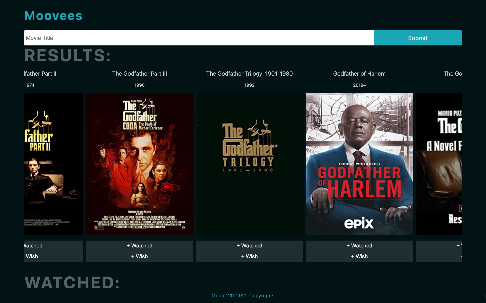
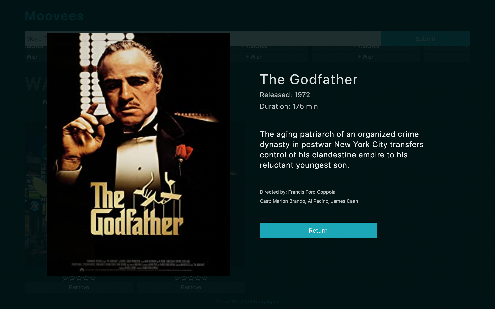

# MOOVEES-APP-ClientOnly-TypeScript

[Live App Here](https://moovees-app-typescript-client.netlify.app/)

Simplified, client-only version of original [MOOVEES-APP](https://github.com/Medic1111/MOOVEES-APP) built with ReactJS in TypeScript. App that allows user to search for movies and tv shows titles, and organize them into "wish" and "watched" lists. Current MVP.

### TECH

1. Front-end:
   - ReactJs/TypeScript
2. Extras:
   - Movies Third Party API
3. Deployment:
   - Netlify

> STATUS: MVP
> Exploring personal rating feature.

#### INSTALL

1. Download the project
2. Open the project and on the root run `npm install`
3. Then run `npm start`
4. You will need an api key from ombd api, create a `.env` file and add the key: `REACT_APP_API_KEY="you_key_with_double_quotes_here"`

#### LICENSE

MIT License
Copyright (c) 2022 Aryse Gabrielle Pagano

---
